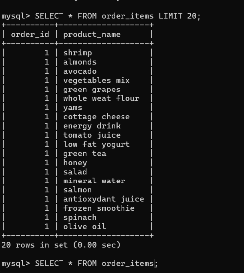
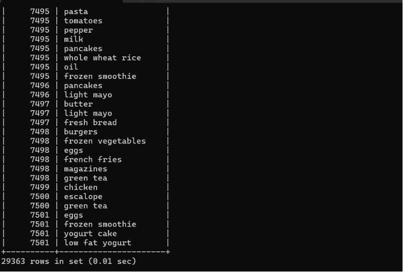
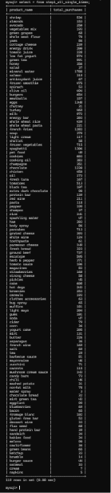
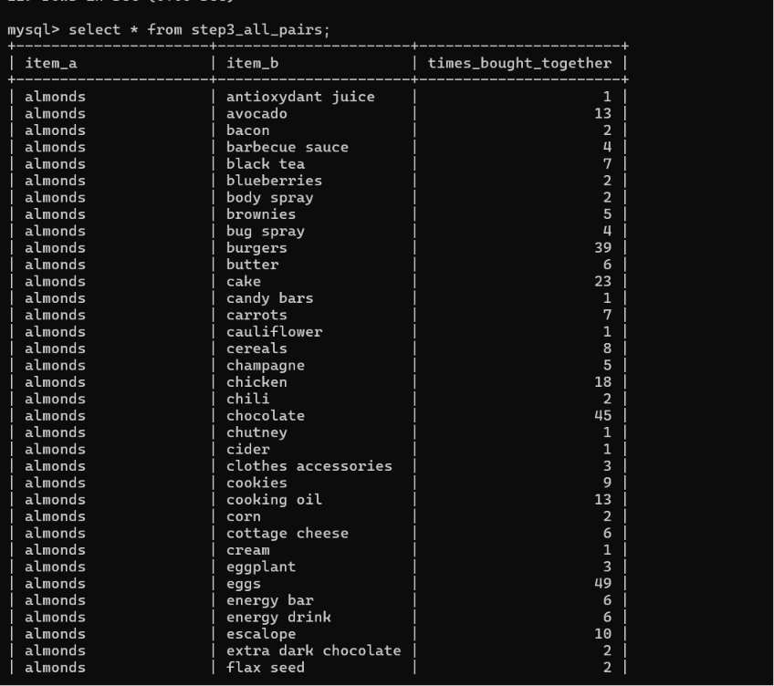
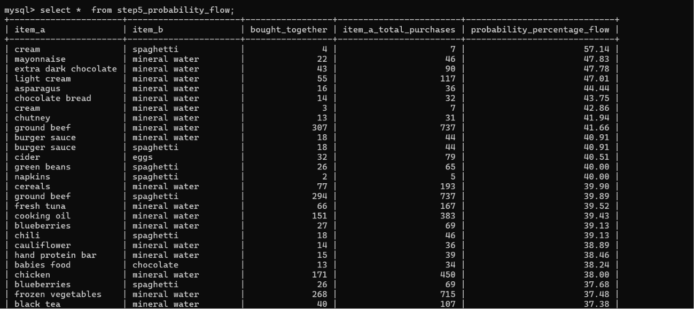
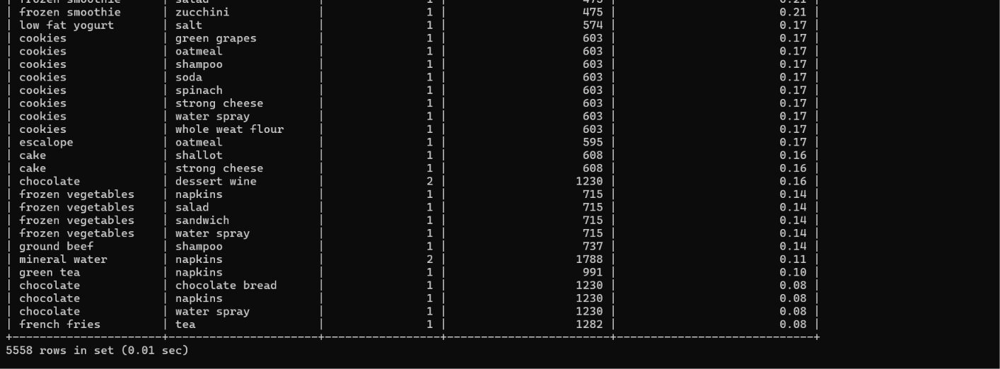
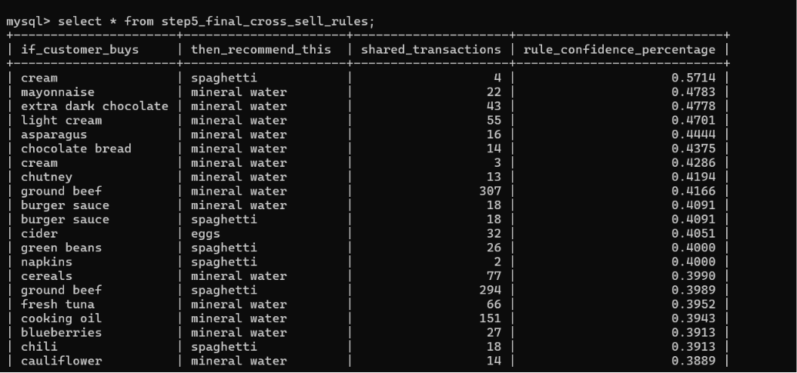
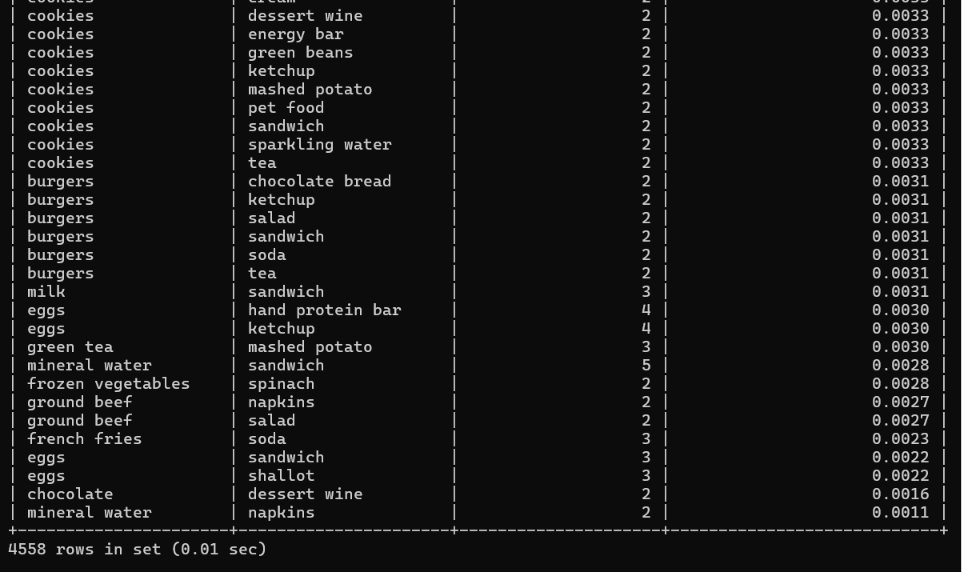

# 🛒 Market Basket Analysis using Apriori Algorithm

> A SQL-based implementation of **Association Rule Mining (Apriori)** using Python and MySQL to discover purchasing patterns from retail transaction data.


---

# 📌 Overview

Market Basket Analysis is a data mining technique used to discover relationships between products purchased together in retail transactions.

This project implements the **Apriori Algorithm** using **Python** and **MySQL**, transforming raw transaction data into meaningful association rules that can be used for:

- Product Recommendation Systems
- Cross-selling Analysis
- Retail Store Layout Optimization
- Marketing Campaigns
- Customer Purchase Behavior Analysis

The workflow begins with loading transaction data using Python and storing it in MySQL. SQL is then used to calculate frequent itemsets and generate association rules using mathematical measures such as **Support**, **Confidence**, and **Probability Flow**.

---

# 📂 Project Structure

```text
mba-sql/
│
├── dataset/
│   └── Market_Basket_Optimisation.csv
│
├── python/
│   ├── insert_data.py
│   └── requirements.txt
│
├── sql/
│   ├── 01_create_database.sql
│   ├── 02_apriori_analysis.sql
│   └── 03_results.sql
│
├── screenshots/
│   ├── order_items_sample.png
│   ├── order_items_end_sample.png
│   ├── single_item_counts.png
│   ├── item_pairs_analysis.png
│   ├── probability_flow_top.png
│   ├── probability_flow_bottom.png
│   ├── final_rules_top.png
│   └── final_rules_bottom.png
│
├── README.md
├── LICENSE
```

---

# ⚙️ Technologies Used

| Technology | Purpose |
|------------|---------|
| Python | Data Cleaning & Data Loading |
| Pandas | CSV Processing |
| MySQL | Database Storage |
| SQL | Association Rule Mining |
| MySQL Connector | Python–MySQL Connection |
| Git & GitHub | Version Control |

---

# 📊 Dataset

Dataset Used:

**Market_Basket_Optimisation.csv**

- **7,501 Transactions**
- **29,363 Product Records**
- Retail purchase transaction dataset

---

# 🔄 Project Workflow

```text
Market Basket Dataset (.csv)
            │
            ▼
Python (Pandas)
            │
            ▼
Data Cleaning & Normalization
            │
            ▼
MySQL Database
            │
            ▼
SQL Association Analysis
            │
            ▼
Support Calculation
            │
            ▼
Confidence Calculation
            │
            ▼
Probability Flow
            │
            ▼
Cross-Selling Recommendations
```

---

# 🚀 Installation

## Clone Repository

```bash
git clone https://github.com/YOUR_USERNAME/mba-sql.git

cd mba-sql
```

---

## Install Dependencies

```bash
pip install -r python/requirements.txt
```

---

## Load Dataset into MySQL

```bash
python python/insert_data.py
```

---

## Execute SQL Scripts

Run the following scripts in order:

```text
01_create_database.sql

↓

02_apriori_analysis.sql

↓

03_results.sql
```

---

# 🧮 Mathematical Formulas

### Support

\[
Support(A)=\frac{Frequency(A)}{Total\ Transactions}
\]

---

### Support of Item Pair

\[
Support(A,B)=\frac{Frequency(A,B)}{Total\ Transactions}
\]

---

### Confidence

\[
Confidence(A \rightarrow B)=
\frac{Support(A,B)}
{Support(A)}
\]

---

### Probability Flow

```text
Probability (%) =
(Times Bought Together /
Total Purchases of Item A)
× 100
```

---
# 📸 Project Screenshots

## 1️⃣ Order Items Table (First 20 Records)

Demonstrates the normalized transaction data after importing the dataset into MySQL using the Python automation script.



---

## 2️⃣ Complete Transaction Dataset

Shows the complete normalized transaction table containing **29,363 records** generated from the Market Basket dataset.



---

## 3️⃣ Single Item Purchase Frequency

Displays the purchase count of every product using SQL `GROUP BY`, forming the basis for Support calculation.



---

## 4️⃣ Candidate Item Pair Generation

Generates all possible product pairs purchased together using SQL Self Join.



---

## 5️⃣ Probability Flow Analysis

Calculates the recommendation probability for every product pair.

### Top Results



### Additional Results



---

## 6️⃣ Final Cross-Selling Rules

The final recommendation table generated from the Apriori analysis.

### Top Rules



### More Rules


---

# 📈 Results

The project successfully generated:

- ✔ Frequent Individual Items
- ✔ Frequent Item Pairs
- ✔ Product Purchase Counts
- ✔ Association Rules
- ✔ Cross-Selling Recommendations
- ✔ Probability-based Product Suggestions

Example:

| If Customer Buys | Recommend |
|------------------|-----------|
| Ground Beef | Mineral Water |
| Chicken | Mineral Water |
| Burger Sauce | Spaghetti |
| Extra Dark Chocolate | Mineral Water |

---

# 💡 Key Features

- Automated CSV ingestion using Python
- MySQL relational database design
- SQL-based Apriori implementation
- Frequent Itemset Generation
- Association Rule Mining
- Support & Confidence calculations
- Cross-selling recommendation generation
- Structured SQL scripts
- Easy-to-understand workflow

---

# 📌 Future Improvements

- Implement Lift calculation
- Add full Apriori implementation in Python
- Build interactive dashboard using Streamlit
- Visualize association networks
- Export recommendations to CSV

---

# 👨‍💻 Author

**Joel Tom Philip**

B.Sc. Data Science

Homi Bhabha State University

FinX Institute

📧 philipjoel800@gmail.com

🔗 LinkedIn:
https://linkedin.com/in/joeltomphilip

🐙 GitHub:
https://github.com/jtp-codes

---

# ⭐ Show Your Support

If you found this project useful, consider giving it a ⭐ on GitHub.

It helps others discover the project and motivates future improvements.

---
